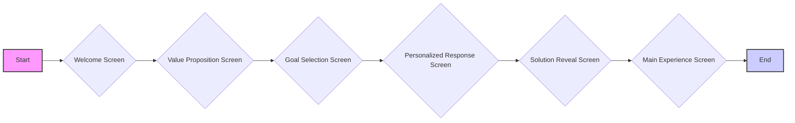

# Product Requirements Document (PRD)

## Purpose
The Vibrasonix app is designed to deliver personalized and effective sound therapy experiences to users seeking to improve their mental wellbeing. It targets individuals who are experiencing:

- **Sleep disorders**: Difficulty falling asleep, staying asleep, or achieving restful sleep.
- **Stress and anxiety**: Feeling overwhelmed, tense, or experiencing excessive worry.
- **Focus and concentration issues**: Struggling to maintain attention, experiencing mental fatigue, or seeking cognitive enhancement.
- **Desire for enhanced meditation**: Looking to deepen meditative states and spiritual exploration.

The app leverages a science-backed approach, combining binaural beats, PEMF (Pulsed Electromagnetic Field) technology, and vibroacoustic therapy, delivered through curated soundscapes. It aims to be a user-friendly, accessible, and empowering tool, offering a "drug without side effects" for mental and physical state transformation. The app is designed to integrate seamlessly with the Vibrasonix-Cube hardware device to provide an enhanced vibroacoustic therapy experience, targeting users interested in a holistic, integrated wellness solution.

## Features

### Detailed Feature List
- **Onboarding Flow:**  A seamless and intuitive onboarding experience to guide new users through the app's value proposition and core functionalities.
- **Personalized Soundscapes:**  AI-powered playlist generator to create customized sound therapy sessions based on user goals and preferences.
- **Extensive Content Library:** A rich library of soundscapes covering various categories like sleep, focus, meditation, and stress reduction, incorporating binaural beats, PEMF, and vibroacoustic therapy principles.
- **Session Controls:**  User-friendly playback controls with customizable settings for intensity, duration, and transitions, allowing users to tailor their sound therapy sessions.
- **Hardware Integration:**  Seamless integration with the Vibrasonix-Cube device for enhanced vibroacoustic therapy.
- **Cymatics Visualization:** Dynamic cymatics patterns that respond in real-time to the audio being played, providing a visual representation of sound vibrations.
- **Haptic Feedback:** Sophisticated haptic feedback system that translates sound frequencies into precise vibration patterns delivered through the phone's haptic engine.
- **User Analytics and Insights:**  Personalized dashboards to track usage patterns, progress towards goals, and effectiveness of different soundscapes.
- **Accessibility Features:**  Comprehensive accessibility options to cater to users with diverse needs, including visual, motor, cognitive, and hearing accessibility.

### User Stories

- As a new user, I want a clear and engaging onboarding process so I can quickly understand how Vibrasonix can benefit me and how to use it.
- As a user focused on improving sleep, I want personalized soundscapes that help me fall asleep faster and achieve deeper, more restful sleep.
- As a user seeking to enhance focus, I want soundscapes designed to sharpen my concentration and improve cognitive performance.
- As a user managing stress and anxiety, I want access to soundscapes that promote relaxation and reduce my stress levels.
- As a user interested in meditation, I want soundscapes that deepen my meditative states and enhance my spiritual exploration.
- As a user with the Vibrasonix-Cube, I want seamless integration and control of the device through the app for a holistic therapy experience.
- As a user, I want to track my progress and understand how Vibrasonix is impacting my wellbeing over time.

### User Journey Flowchart

- **Welcome Screen:**  The first screen users see, designed to capture attention and introduce the core concept of Vibrasonix.
- **Value Proposition Screen:**  Clearly communicates the unique value and benefits of Vibrasonix, highlighting its science-backed approach and integrated hardware-software solution.
- **Goal Selection Screen:**  Allows users to select their primary wellness goals, enabling personalization of the app experience.
- **Personalized Response Screen:**  Confirms the app's relevance to the user's selected goals and reinforces the value proposition.
- **Solution Reveal Screen:**  Creates a memorable and impactful moment by revealing "sound" as the key solution for mental wellbeing.
- **Main Experience Screen:**  The central hub of the app, providing access to personalized soundscapes and core functionalities.

This flowchart visually represents the intended user journey through the initial screens of the Vibrasonix app, focusing on onboarding and setting the stage for the core sound therapy experience.

## Technical Requirements

### Platform Specifications
- **Mobile Platforms**: iOS and Android
    - **Native Development**: Develop natively for optimal performance and platform-specific feature access.
    - **UI Consistency**: Maintain a consistent user experience and visual design across both platforms, adhering to platform-specific UI guidelines where appropriate while maintaining a unified brand aesthetic.
- **Vibrasonix-Cube Integration**: Bluetooth LE for communication between the app and the hardware device.
    - **Low-Latency Connection**: Ensure a low-latency and reliable connection for real-time control and synchronization between the app and the Cube.
    - **Error Handling**: Implement robust error handling for Bluetooth connection issues and Cube communication failures.

### Performance Benchmarks
- **Responsiveness**:
    - **UI Interactions**: Ensure UI interactions are highly responsive, with a maximum latency of 100ms for touch responses and screen transitions.
    - **Soundscape Playback**: Guarantee gapless playback of soundscapes without interruptions or stutters.
- **Resource Usage**:
    - **Memory Management**: Optimize memory usage to keep the app under 150MB to ensure smooth performance on low-to-mid range mobile devices.
    - **CPU Efficiency**: Minimize CPU usage, aiming for below 20% during typical app usage to prevent battery drain and overheating.
- **Battery Efficiency**:
    - **Background Playback Optimization**: Optimize background playback to minimize battery consumption, allowing for extended therapy sessions without excessive battery drain.
    - **Power-Saving Modes**: Implement power-saving modes for extended sessions, further reducing battery usage during long soundscape playback.
- **Loading Times**:
    - **App Launch Time**: Ensure a fast app launch, with a cold start time of under 2 seconds.
    - **Soundscape Loading**: Minimize soundscape loading times, aiming to load and begin playback within 1 second of user selection.

### Accessibility Compliance
- **WCAG 2.1 AA Compliance**: Achieve and maintain WCAG 2.1 Level AA compliance throughout the app.
    - **Visual Accessibility**: Implement options for high contrast mode, adjustable text sizes, alternative color schemes, and full screen reader compatibility.
    - **Motor Accessibility**: Provide motor accessibility options such as voice control, simplified UI mode, and gesture customization to accommodate users with motor impairments.
    - **Cognitive Accessibility**: Design for cognitive accessibility by ensuring simplified navigation, step-by-step guides for complex tasks, and consistent UI patterns throughout the app.
    - **Hearing Accessibility**: Include hearing accessibility features like frequency shifting for users with frequency-specific hearing loss, vibration-only modes for Cube feedback, and visual representations of audio content.
